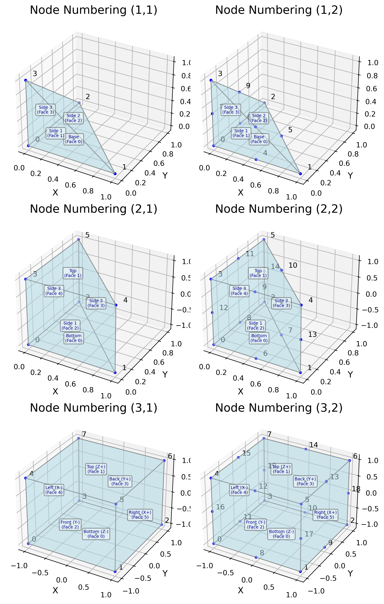
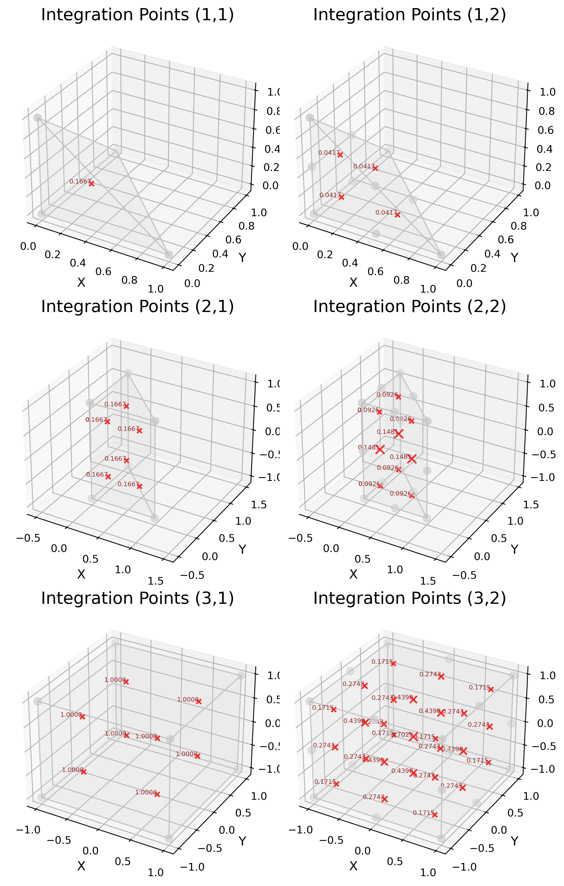

# FEA 单元参考文档

本文档提供了 FEA 软件包中实现的各种有限元类型的详细信息，包括其数学公式、形函数、积分方案以及沙漏控制等特殊注意事项。

## 目录

- [FEA 单元参考文档](#fea-单元参考文档)
  - [目录](#目录)
  - [引言](#引言)
  - [单元命名约定](#单元命名约定)
  - [单元公式](#单元公式)
    - [C3D4：4节点四面体单元](#c3d44节点四面体单元)
    - [C3D6：6节点楔形单元](#c3d66节点楔形单元)
    - [C3D8R \& C3D8：8节点六面体单元](#c3d8r--c3d88节点六面体单元)
    - [C3D10：10节点四面体单元](#c3d1010节点四面体单元)
    - [C3D15：15节点楔形单元](#c3d1515节点楔形单元)
    - [C3D20 \& C3D20R：20节点六面体单元](#c3d20--c3d20r20节点六面体单元)
  - [沙漏控制理论](#沙漏控制理论)
    - [沙漏现象](#沙漏现象)
    - [沙漏模式](#沙漏模式)
    - [稳定化方法](#稳定化方法)
    - [C3D8R 中的实现](#c3d8r-中的实现)
  - [附录](#附录)

## 引言

有限元分析 (FEA) 依赖于将复杂的几何域离散为称为单元的更简单的子域。每种单元类型都有其特定的特性，使其适用于不同类型的分析。本文档涵盖了我们 FEA 软件包中实现的各种三维连续体单元。

## 单元命名约定

我们的单元命名约定遵循 Abaqus 标准：

- **C**: 连续体单元
- **3D**: 三维
- **数字**: 表示单元中的节点数量
- **后缀**:
  - **R**: 减缩积分
  - 无后缀: 完全积分

## 单元公式

本节提供了每种单元类型的详细数学公式。参数坐标统一称为 $g, h, r$。

### C3D4：4节点四面体单元

**描述**:

C3D4 是一阶（线性）四面体单元，有4个节点，每个顶点一个。它是一个常应变单元，由于其简单性，常用于复杂几何体的网格划分。

**节点排列和参数坐标 ($g, h, r$)**:

单元在参数空间中使用坐标 $g, h, r$ 定义。这些可以被认为是体积坐标或重心坐标。节点通常位于：

| 节点 | $g$ | $h$ | $r$ |
| :--- | :---- | :---- | :---- |
| 0    | 0     | 0     | 0     |
| 1    | 1     | 0     | 0     |
| 2    | 0     | 1     | 0     |
| 3    | 0     | 0     | 1     |

**面定义**:

- 面 0: 节点 [0, 2, 1]
- 面 1: 节点 [0, 1, 3]
- 面 2: 节点 [1, 2, 3]
- 面 3: 节点 [0, 3, 2]

**形函数**:

形函数 $N_i(g,h,r)$ 为：

$N_0(g,h,r) = 1 - g - h - r$

$N_1(g,h,r) = g$

$N_2(g,h,r) = h$

$N_3(g,h,r) = r$

矩阵形式：

$\mathbf{N} = [N_0, N_1, N_2, N_3] = [1-g-h-r, g, h, r]$

这些形函数可以用一个系数矩阵表示，行代表节点，列代表基函数：

**C3D4 形函数系数矩阵**:

| 节点 | $1$ | $g$ | $h$ | $r$ |
| :--- | :---: | :---: | :---: | :---: |
| 0    |   1   |  -1  |  -1  |  -1  |
| 1    |   0   |   1   |   0   |   0   |
| 2    |   0   |   0   |   1   |   0   |
| 3    |   0   |   0   |   0   |   1   |

**积分**:

C3D4 通常使用单个高斯积分点进行标准（完全）积分：

| 点 | $g$ | $h$ | $r$ | 权重 |
| :- | :---- | :---- | :---- | :--- |
| 1  | 0.25  | 0.25  | 0.25  | 1/6  |

*(注意：权重 1/6 适用于体积为 1/6 的规范四面体。如果在数值积分中使用雅可比行列式，则权重通常取为 1，体积元 $dV = \det(J) dg dh dr$。)*

**优点**:

- 公式和实现简单。
- 有效用于复杂三维域的自动网格划分。
- 每个单元的计算效率高。

**缺点**:

- 容易表现出过度刚硬的行为，尤其是在弯曲主导的问题中（剪切锁定）。
- 单元内的应力和应变是恒定的。
- 对于具有高应力/应变梯度的问题，需要非常精细的网格才能达到良好的精度。

### C3D6：6节点楔形单元

**描述**:

C3D6 是一阶（线性）楔形（或棱柱）单元，有6个节点，每个三角形面上有三个。

**节点排列和参数坐标 ($g, h, r$)**:

该单元使用参数坐标 $g, h$ 表示三角形基底（类似于面积坐标），$r$ 表示高度（通常从 -1 标准化到 1）。

| 节点 | $g$ | $h$ | $r$ |
| :--- | :---- | :---- | :---- |
| 0    | 0     | 0     | -1    |
| 1    | 1     | 0     | -1    |
| 2    | 0     | 1     | -1    |
| 3    | 0     | 0     | 1     |
| 4    | 1     | 0     | 1     |
| 5    | 0     | 1     | 1     |

*(此处，$g$ 和 $h$ 作为三角形面三个重心坐标中的两个，第三个是 $1-g-h$。)*

**面定义**:

- 面 0 (底部三角形面): 节点 [0,2,1]
- 面 1 (顶部三角形面): 节点 [3, 4, 5]
- 面 2 (侧面四边形 1): 节点 [0, 1, 4, 3]
- 面 3 (侧面四边形 2): 节点 [1, 2, 5, 4]
- 面 4 (侧面四边形 3): 节点 [2, 0, 3, 5]

**形函数**:

令 $L_0 = 1-g-h$, $L_1 = g$, $L_2 = h$。

$N_0(g,h,r) = 0.5 \cdot L_0 \cdot (1 - r)$

$N_1(g,h,r) = 0.5 \cdot L_1 \cdot (1 - r)$

$N_2(g,h,r) = 0.5 \cdot L_2 \cdot (1 - r)$

$N_3(g,h,r) = 0.5 \cdot L_0 \cdot (1 + r)$

$N_4(g,h,r) = 0.5 \cdot L_1 \cdot (1 + r)$

$N_5(g,h,r) = 0.5 \cdot L_2 \cdot (1 + r)$

矩阵形式：

$\mathbf{N} = [N_0, N_1, N_2, N_3, N_4, N_5]$

基函数的系数矩阵表示：

**C3D6 形函数系数矩阵**:

| 节点 | $1$ | $g$ | $h$ | $r$ | $g \cdot r$ | $h \cdot r$ |
| :--- | :---: | :---: | :---: | :---: | :-----------: | :-----------: |
| 0    |  0.5  | -0.5  | -0.5  | -0.5 |      0.5      |      0.5      |
| 1    |  0.0  |  0.5  |  0.0  |  0.0  |     -0.5      |      0.0      |
| 2    |  0.0  |  0.0  |  0.5  |  0.0  |      0.0      |     -0.5      |
| 3    |  0.5  | -0.5  | -0.5  |  0.5  |     -0.5      |     -0.5      |
| 4    |  0.0  |  0.5  |  0.0  |  0.0  |      0.5      |      0.0      |
| 5    |  0.0  |  0.0  |  0.5  |  0.0  |      0.0      |      0.5      |

*(注意：表格中省略了全为零的附加列。)*

**积分**:

C3D6 通常使用6个积分点进行完全积分（三角形的2点高斯法则和直线的3点高斯法则的乘积，或棱柱的特定6点方案）。常见的方案是在 $g,h$ 平面（三角形面）使用2个点，并沿 $r$ 轴使用3个点。

一种常见的方案使用基于三角形求积的基点和高斯求积的高度点：

| 点 | $g$ (约) | $h$ (约) | $r$    | 权重 (约) |
| :- | :--------- | :--------- | :------- | :-------- |
| 1  | 1/6        | 1/6        | -√(1/3) | 1/6       |
| 2  | 2/3        | 1/6        | -√(1/3) | 1/6       |
| 3  | 1/6        | 2/3        | -√(1/3) | 1/6       |
| 4  | 1/6        | 1/6        | √(1/3)  | 1/6       |
| 5  | 2/3        | 1/6        | √(1/3)  | 1/6       |
| 6  | 1/6        | 2/3        | √(1/3)  | 1/6       |

*(注意：权重和位置可能因所选的具体求积规则而异。总权重和应对应于参数体积，例如，对于基底面积为1/2、高度为2的棱柱，总权重和为2)。*

**优点**:

- 用于在四面体和六面体网格之间过渡。
- 可以有效地模拟棱柱区域。

**缺点**:

- 可能会出现类似于 C3D4 的锁定行为。
- 不如四面体或六面体单元常见。

### C3D8R & C3D8：8节点六面体单元

**描述**:

C3D8 是一阶（线性）六面体（砖块）单元，在其角点处有8个节点。C3D8R 是其减缩积分变体。参数坐标 $g, h, r$ 的范围从 -1 到 1。

**节点排列和参数坐标 ($g,h,r$)**:

| 节点 | $g$ | $h$ | $r$ |
| :--- | :---: | :---: | :---: |
| 0    |  -1  |  -1  |  -1  |
| 1    |   1   |  -1  |  -1  |
| 2    |   1   |   1   |  -1  |
| 3    |  -1  |   1   |  -1  |
| 4    |  -1  |  -1  |   1   |
| 5    |   1   |  -1  |   1   |
| 6    |   1   |   1   |   1   |
| 7    |  -1  |   1   |   1   |

**面定义**:

- 面 0 (底部, $r=-1$): 节点 0-1-2-3
- 面 1 (顶部, $r=1$): 节点 4-5-6-7
- 面 2 (前部, $h=-1$): 节点 0-1-5-4 (*假设标准视图*)
- 面 3 (后部, $h=1$): 节点 3-2-6-7
- 面 4 (左部, $g=-1$): 节点 0-3-7-4
- 面 5 (右部, $g=1$): 节点 1-2-6-5

**形函数**:

对于节点 $i$，其参数坐标为 $(g_i, h_i, r_i)$:

$N_i(g,h,r) = \frac{1}{8} (1 + g \cdot g_i) (1 + h \cdot h_i) (1 + r \cdot r_i)$

例如 $N_0(g,h,r)$ 其中 $(g_0,h_0,r_0) = (-1,-1,-1)$:

$N_0(g,h,r) = \frac{1}{8} (1 - g) (1 - h) (1 - r)$

矩阵形式：

$\mathbf{N} = [N_0, N_1, N_2, N_3, N_4, N_5, N_6, N_7]$

基函数的系数矩阵表示：

**C3D8 形函数系数矩阵**:

| 节点 | $1$ | $g$ | $h$ | $r$ | $g \cdot h$ | $h \cdot r$ | $r \cdot g$ | $g \cdot h \cdot r$ |
| :--- | :---: | :----: | :----: | :----: | :-----------: | :-----------: | :-----------: | :-------------------: |
| 0    | 0.125 | -0.125 | -0.125 | -0.125 |     0.125     |     0.125     |     0.125     |        -0.125        |
| 1    | 0.125 | 0.125 | -0.125 | -0.125 |    -0.125    |    -0.125    |     0.125     |         0.125         |
| 2    | 0.125 | 0.125 | 0.125 | -0.125 |     0.125     |    -0.125    |    -0.125    |        -0.125        |
| 3    | 0.125 | -0.125 | 0.125 | -0.125 |    -0.125    |     0.125     |    -0.125    |         0.125         |
| 4    | 0.125 | -0.125 | -0.125 | 0.125 |    -0.125    |    -0.125    |    -0.125    |         0.125         |
| 5    | 0.125 | 0.125 | -0.125 | 0.125 |     0.125     |     0.125     |    -0.125    |        -0.125        |
| 6    | 0.125 | 0.125 | 0.125 | 0.125 |    -0.125    |     0.125     |     0.125     |         0.125         |
| 7    | 0.125 | -0.125 | 0.125 | 0.125 |     0.125     |    -0.125    |     0.125     |        -0.125        |

**积分**:

- **C3D8 (完全积分)**: 使用 $2 \times 2 \times 2 = 8$ 个高斯点。
  位置: $(g,h,r) = (\pm 1/\sqrt{3}, \pm 1/\sqrt{3}, \pm 1/\sqrt{3})$。每个点的权重为 1。
- **C3D8R (减缩积分)**: 在中心使用 1 个高斯点。
  位置: $(g,h,r) = (0, 0, 0)$。权重为 8。

**优点**:

- **C3D8**: 通常很稳健，但可能遭受剪切和体积锁定。
- **C3D8R**:
  - 由于单个积分点，计算效率高。
  - 避免剪切锁定。
  - 通常首选用于体变形问题。
  - 如果使用选择性减缩积分（非标准 C3D8R），则在近乎不可压缩的情况下无体积锁定。

**缺点**:

- **C3D8**: 在弯曲时可能过于刚硬。
- **C3D8R**:
  - 易受沙漏模式（零能量变形模式）影响，需要稳定化处理（参见[沙漏控制理论](#沙漏控制理论)）。
  - 与完全积分或高阶单元相比，对于具有高应力梯度的问题可能不够准确。

### C3D10：10节点四面体单元

**描述**:

C3D10 是二次（二阶）四面体单元，有10个节点：4个在顶点，6个在边的中点。

**节点排列和参数坐标 ($g, h, r$)**:

参数坐标 $g, h, r$ 是体积/重心坐标。

| 节点 | $g$ | $h$ | $r$ | 位置        |
| :--- | :---- | :---- | :---- | :---------- |
| 0    | 0     | 0     | 0     | 顶点        |
| 1    | 1     | 0     | 0     | 顶点        |
| 2    | 0     | 1     | 0     | 顶点        |
| 3    | 0     | 0     | 1     | 顶点        |
| 4    | 0.5   | 0     | 0     | 边 0-1 中点 |
| 5    | 0.5   | 0.5   | 0     | 边 1-2 中点 |
| 6    | 0     | 0.5   | 0     | 边 2-0 中点 |
| 7    | 0     | 0     | 0.5   | 边 0-3 中点 |
| 8    | 0.5   | 0     | 0.5   | 边 1-3 中点 |
| 9    | 0     | 0.5   | 0.5   | 边 2-3 中点 |

**形函数**:

令 $L_0 = 1-g-h-r$, $L_1 = g$, $L_2 = h$, $L_3 = r$。

顶点节点 (例如，节点 0, 1, 2, 3):

$N_0(g,h,r) = L_0 (2 L_0 - 1)$

$N_1(g,h,r) = L_1 (2 L_1 - 1)$

$N_2(g,h,r) = L_2 (2 L_2 - 1)$

$N_3(g,h,r) = L_3 (2 L_3 - 1)$

边中点节点 (例如，节点 4 在 0 和 1 之间，节点 5 在 1 和 2 之间):

$N_4(g,h,r) = 4 L_0 L_1$

$N_5(g,h,r) = 4 L_1 L_2$

$N_6(g,h,r) = 4 L_2 L_0$

$N_7(g,h,r) = 4 L_0 L_3$

$N_8(g,h,r) = 4 L_1 L_3$

$N_9(g,h,r) = 4 L_2 L_3$

矩阵形式：

$\mathbf{N} = [N_0, N_1, N_2, N_3, N_4, N_5, N_6, N_7, N_8, N_9]$

基函数的系数矩阵表示：

**C3D10 形函数系数矩阵**:

| 节点 | $1$ | $g$ | $h$ | $r$ | $g \cdot h$ | $h \cdot r$ | $r \cdot g$ | $g^2$ | $h^2$ | $r^2$ |
| :--- | :---: | :---: | :---: | :---: | :-----------: | :-----------: | :-----------: | :-----: | :-----: | :-----: |
| 0    |  1.0  | -3.0 | -3.0 | -3.0 |      4.0      |      4.0      |      4.0      |   2.0   |   2.0   |   2.0   |
| 1    |  0.0  | -1.0 |  0.0  |  0.0  |      0.0      |      0.0      |      0.0      |   2.0   |   0.0   |   0.0   |
| 2    |  0.0  |  0.0  | -1.0 |  0.0  |      0.0      |      0.0      |      0.0      |   0.0   |   2.0   |   0.0   |
| 3    |  0.0  |  0.0  |  0.0  | -1.0 |      0.0      |      0.0      |      0.0      |   0.0   |   0.0   |   2.0   |
| 4    |  0.0  |  4.0  |  0.0  |  0.0  |     -4.0     |      0.0      |     -4.0     |  -4.0  |   0.0   |   0.0   |
| 5    |  0.0  |  0.0  |  0.0  |  0.0  |      4.0      |      0.0      |      0.0      |   0.0   |   0.0   |   0.0   |
| 6    |  0.0  |  0.0  |  4.0  |  0.0  |     -4.0     |     -4.0     |      0.0      |   0.0   |  -4.0  |   0.0   |
| 7    |  0.0  |  0.0  |  0.0  |  4.0  |      0.0      |     -4.0     |     -4.0     |   0.0   |   0.0   |  -4.0  |
| 8    |  0.0  |  0.0  |  0.0  |  0.0  |      0.0      |      0.0      |      4.0      |   0.0   |   0.0   |   0.0   |
| 9    |  0.0  |  0.0  |  0.0  |  0.0  |      0.0      |      4.0      |      0.0      |   0.0   |   0.0   |   0.0   |

**积分**:

C3D10 通常使用4个高斯点进行标准积分。

| 点 | $g$ (约) | $h$ (约) | $r$ (约) | 权重 (约) |
| :- | :--------- | :--------- | :--------- | :-------- |
| 1  | 0.58541020 | 0.13819660 | 0.13819660 | 1/24      |
| 2  | 0.13819660 | 0.58541020 | 0.13819660 | 1/24      |
| 3  | 0.13819660 | 0.13819660 | 0.58541020 | 1/24      |
| 4  | 0.13819660 | 0.13819660 | 0.13819660 | 1/24      |

*(注意：总权重和为 4 * (1/24) = 1/6，对应于规范四面体的体积。)*

**优点**:

- 由于二次插值，比 C3D4 精度更高。
- 更适合模拟弯曲边界。
- 与 C3D4 相比，对网格质量和变形的敏感性较低。
- 改进的应力和应变表示。

**缺点**:

- 每个单元的计算成本比 C3D4 高。
- 公式更复杂。

### C3D15：15节点楔形单元

**描述**:

C3D15 是二次（二阶）楔形/棱柱单元，有15个节点：6个在顶点，9个在边的中点。

**节点排列和参数坐标 ($g, h, r$)**:

$g, h$ 是三角形基底的参数坐标，$r$ 是高度的参数坐标（从 -1 标准化到 1）。

| 节点 | $g$ | $h$ | $r$ | 位置           |
| :--- | :---- | :---- | :---- | :------------- |
| 0    | 0     | 0     | -1    | 顶点           |
| 1    | 1     | 0     | -1    | 顶点           |
| 2    | 0     | 1     | -1    | 顶点           |
| 3    | 0     | 0     | 1     | 顶点           |
| 4    | 1     | 0     | 1     | 顶点           |
| 5    | 0     | 1     | 1     | 顶点           |
| 6    | 0.5   | 0     | -1    | 基底边中点     |
| 7    | 0.5   | 0.5   | -1    | 基底边中点     |
| 8    | 0     | 0.5   | -1    | 基底边中点     |
| 9    | 0.5   | 0     | 1     | 顶面边中点     |
| 10   | 0.5   | 0.5   | 1     | 顶面边中点     |
| 11   | 0     | 0.5   | 1     | 顶面边中点     |
| 12   | 0     | 0     | 0     | 高度方向边中点 |
| 13   | 1     | 0     | 0     | 高度方向边中点 |
| 14   | 0     | 1     | 0     | 高度方向边中点 |

**形函数**:

形函数 (对三角形基底使用 $L_0=1-g-h, L_1=g, L_2=h$，对高度使用 $r_p \in \{-1,0,1\}$):

角点节点 (例如，节点 0: 基底为 $L_0(2L_0-1)$，对于 $r=-1$ 为 $0.5r(r-1)$):

$N_0(g,h,r) = L_0(2L_0-1) \cdot 0.5r(r-1)$

$N_1(g,h,r) = L_1(2L_1-1) \cdot 0.5r(r-1)$

$N_2(g,h,r) = L_2(2L_2-1) \cdot 0.5r(r-1)$

(对于节点 3,4,5 类似，对于 $r=1$ 为 $0.5r(r+1)$)

$N_3(g,h,r) = L_0(2L_0-1) \cdot 0.5r(r+1)$

$N_4(g,h,r) = L_1(2L_1-1) \cdot 0.5r(r+1)$

$N_5(g,h,r) = L_2(2L_2-1) \cdot 0.5r(r+1)$

基底三角形上的边中点节点 (例如，节点 6: 基底为 $4L_0L_1$，对于 $r=-1$ 为 $0.5r(r-1)$):

$N_6(g,h,r) = 4L_0L_1 \cdot 0.5r(r-1)$

$N_7(g,h,r) = 4L_1L_2 \cdot 0.5r(r-1)$

$N_8(g,h,r) = 4L_2L_0 \cdot 0.5r(r-1)$

(对于节点 9,10,11 类似，对于 $r=1$ 为 $0.5r(r+1)$)

$N_9(g,h,r) = 4L_0L_1 \cdot 0.5r(r+1)$

$N_{10}(g,h,r)= 4L_1L_2 \cdot 0.5r(r+1)$

$N_{11}(g,h,r)= 4L_2L_0 \cdot 0.5r(r+1)$

高度方向的边中点节点 (例如，节点 12: 基底为 $L_0(2L_0-1)$，对于 $r=0$ 为 $(1-r^2)$):

$N_{12}(g,h,r) = L_0(2L_0-1) \cdot (1-r^2)$

$N_{13}(g,h,r) = L_1(2L_1-1) \cdot (1-r^2)$

$N_{14}(g,h,r) = L_2(2L_2-1) \cdot (1-r^2)$

矩阵形式：

$\mathbf{N} = [N_0, N_1, ..., N_{14}]$

**C3D15 形函数系数矩阵**:

| 节点 | $1$ | $g$ | $h$ | $r$ | $g^2$ | $h^2$ | $r^2$ | $gh$ | $gr$ | $hr$ | $g^2r$ | $h^2r$ | $ghr$ | $gh^2$ | $g^2h$ |
| :--- | :---: | :---: | :---: | :---: | :-----: | :-----: | :-----: | :----: | :----: | :----: | :------: | :------: | :-----: | :------: | :------: |
| 0    |  0.0  |  0.0  |  0.0  | -0.5 |   0.0   |   0.0   |   0.5   |  0.0  |  0.0  |  0.0  |   0.0   |   0.0   |   0.0   |   0.0   |   0.0   |
| 1    |  0.0  |  0.0  |  0.0  |  0.0  |  -0.5  |   0.0   |   0.5   |  0.0  |  1.0  |  0.0  |   -1.0   |   0.0   |   0.0   |   0.0   |   0.0   |
| 2    |  0.0  |  0.0  |  0.0  |  0.0  |   0.0   |  -0.5  |   0.5   |  0.0  |  0.0  |  1.0  |   0.0   |   -1.0   |   0.0   |   0.0   |   0.0   |
| 3    |  0.0  |  0.0  |  0.0  |  0.5  |   0.0   |   0.0   |  -0.5  |  0.0  |  0.0  |  0.0  |   0.0   |   0.0   |   0.0   |   0.0   |   0.0   |
| 4    |  0.0  |  0.0  |  0.0  |  0.0  |  -0.5  |   0.0   |  -0.5  |  0.0  |  1.0  |  0.0  |   -1.0   |   0.0   |   0.0   |   0.0   |   0.0   |
| 5    |  0.0  |  0.0  |  0.0  |  0.0  |   0.0   |  -0.5  |  -0.5  |  0.0  |  0.0  |  1.0  |   0.0   |   -1.0   |   0.0   |   0.0   |   0.0   |
| 6    |  0.0  |  0.0  |  0.0  | -2.0 |   0.0   |   0.0   |   2.0   |  0.0  |  0.0  |  0.0  |   0.0   |   0.0   |   0.0   |   0.0   |   0.0   |
| 7    |  0.0  |  0.0  |  0.0  |  0.0  |   0.0   |   0.0   |   2.0   |  -2.0  |  0.0  |  0.0  |   0.0   |   0.0   |   4.0   |   0.0   |   0.0   |
| 8    |  0.0  |  0.0  |  0.0  | -2.0 |   0.0   |   0.0   |   2.0   |  0.0  |  0.0  |  0.0  |   0.0   |   0.0   |   0.0   |   0.0   |   0.0   |
| 9    |  0.0  |  0.0  |  0.0  |  2.0  |   0.0   |   0.0   |  -2.0  |  0.0  |  0.0  |  0.0  |   0.0   |   0.0   |   0.0   |   0.0   |   0.0   |
| 10   |  0.0  |  0.0  |  0.0  |  0.0  |   0.0   |   0.0   |  -2.0  |  -2.0  |  0.0  |  0.0  |   0.0   |   0.0   |   4.0   |   0.0   |   0.0   |
| 11   |  0.0  |  0.0  |  0.0  |  2.0  |   0.0   |   0.0   |  -2.0  |  0.0  |  0.0  |  0.0  |   0.0   |   0.0   |   0.0   |   0.0   |   0.0   |
| 12   |  1.0  | -3.0 | -3.0 |  0.0  |   2.0   |   2.0   |  -1.0  |  4.0  |  0.0  |  0.0  |   0.0   |   0.0   |   0.0   |   0.0   |   0.0   |
| 13   |  0.0  |  1.0  |  0.0  |  0.0  |   0.0   |   0.0   |  -1.0  |  0.0  |  0.0  |  0.0  |   0.0   |   0.0   |   0.0   |   0.0   |   0.0   |
| 14   |  0.0  |  0.0  |  1.0  |  0.0  |   0.0   |   0.0   |  -1.0  |  0.0  |  0.0  |  0.0  |   0.0   |   0.0   |   0.0   |   0.0   |   0.0   |

*(注意：此矩阵由展开形函数公式推导而来。为清晰起见，可能省略了一些高阶项和交叉项。零系数表示这些项对该节点的形函数没有贡献。)*

**积分**:

C3D15 通常使用9个积分点（例如，三角形基底使用3点法则，高度使用3点高斯法则）。

| 点组 | 三角形内$g,h$ 坐标 (约)       | $r$ 坐标 (约)     | 权重 (约)        |
| :--- | :------------------------------ | :------------------ | :--------------- |
| 1-3  | (1/6,1/6), (2/3,1/6), (1/6,2/3) | -√(3/5) 或 -0.7746 | (每个 1/6 * 5/9) |
| 4-6  | (1/6,1/6), (2/3,1/6), (1/6,2/3) | 0                   | (每个 1/6 * 8/9) |
| 7-9  | (1/6,1/6), (2/3,1/6), (1/6,2/3) | √(3/5) 或  0.7746  | (每个 1/6 * 5/9) |

*(注意：具体的权重和点取决于所选的求积方法。对于体积为1的规范棱柱（基底面积1/2，高度2），总权重和应为1。)*

**优点**:

- 适用于模拟弯曲边界和复杂的棱柱形状。
- 比线性楔形单元精度更高。

**缺点**:

- 计算量更大。
- 不如 C3D10 或 C3D20 常见。

### C3D20 & C3D20R：20节点六面体单元

**描述**:

C3D20 是二次（二阶）六面体（砖块）单元，有20个节点：8个在角点，12个在边的中点。C3D20R 是其减缩积分变体。参数坐标 $g, h, r$ 的范围从 -1 到 1。

**节点排列和参数坐标 ($g,h,r$)**:

| 节点 | $g$ | $h$ | $r$ | 位置       |
| :--- | :---: | :---: | :---: | :--------- |
| 0    |  -1  |  -1  |  -1  | 角点       |
| 1    |   1   |  -1  |  -1  | 角点       |
| 2    |   1   |   1   |  -1  | 角点       |
| 3    |  -1  |   1   |  -1  | 角点       |
| 4    |  -1  |  -1  |   1   | 角点       |
| 5    |   1   |  -1  |   1   | 角点       |
| 6    |   1   |   1   |   1   | 角点       |
| 7    |  -1  |   1   |   1   | 角点       |
| 8    |   0   |  -1  |  -1  | 底面边中点 |
| 9    |   1   |   0   |  -1  | 底面边中点 |
| 10   |   0   |   1   |  -1  | 底面边中点 |
| 11   |  -1  |   0   |  -1  | 底面边中点 |
| 12   |   0   |  -1  |   1   | 顶面边中点 |
| 13   |   1   |   0   |   1   | 顶面边中点 |
| 14   |   0   |   1   |   1   | 顶面边中点 |
| 15   |  -1  |   0   |   1   | 顶面边中点 |
| 16   |  -1  |  -1  |   0   | 侧面边中点 |
| 17   |   1   |  -1  |   0   | 侧面边中点 |
| 18   |   1   |   1   |   0   | 侧面边中点 |
| 19   |  -1  |   1   |   0   | 侧面边中点 |

**形函数 (Serendipity 函数)**:

令 $(g_i, h_i, r_i)$ 为节点 $i$ 的坐标。

角点节点 (i = 0 到 7):

$N_i(g,h,r) = \frac{1}{8} (1 + g g_i)(1 + h h_i)(1 + r r_i) (g g_i + h h_i + r r_i - 2)$

$g_i=0$ 的边中点节点 (例如，节点 8: $g_8=0, h_8=-1, r_8=-1$):

$N_i(g,h,r) = \frac{1}{4} (1 - g^2)(1 + h h_i)(1 + r r_i)$

$h_i=0$ 的边中点节点 (例如，节点 9: $g_9=1, h_9=0, r_9=-1$):

$N_i(g,h,r) = \frac{1}{4} (1 + g g_i)(1 - h^2)(1 + r r_i)$

$r_i=0$ 的边中点节点 (例如，节点 16: $g_{16}=-1, h_{16}=-1, r_{16}=0$):

$N_i(g,h,r) = \frac{1}{4} (1 + g g_i)(1 + h h_i)(1 - r^2)$

矩阵形式：

$\mathbf{N} = [N_0, N_1, ..., N_{19}]$

**C3D20 形函数系数矩阵**:

| 节点 | $1$   | $g$   | $h$   | $r$   | $g^2$ | $h^2$ | $r^2$ | $gh$  | $gr$  | $hr$  | $ghr$ | $g^2h$ | $gh^2$ | $gr^2$ | $hr^2$ | $g^2r$ | $h^2r$ | $g^2hr$ | $gh^2r$ | $ghr^2$ |
| ---- | ------- | ------- | ------- | ------- | ------- | ------- | ------- | ------- | ------- | ------- | ------- | -------- | -------- | -------- | -------- | -------- | -------- | --------- | --------- | --------- |
| 0    | -0.2500 | 0.1250  | 0.1250  | 0.1250  | 0.0000  | 0.0000  | 0.0000  | 0.1250  | 0.1250  | 0.1250  | -0.1250 | -0.1250  | -0.1250  | -0.1250  | -0.1250  | -0.1250  | 0.0000   | 0.0000    | 0.0000    | 0.0000    |
| 1    | -0.2500 | -0.1250 | 0.1250  | 0.1250  | 0.0000  | 0.0000  | 0.0000  | 0.1250  | 0.1250  | 0.1250  | -0.1250 | 0.1250   | -0.1250  | -0.1250  | 0.1250   | -0.1250  | 0.1250   | 0.0000    | 0.0000    | 0.0000    |
| 2    | -0.2500 | -0.1250 | -0.1250 | 0.1250  | 0.0000  | 0.0000  | 0.0000  | 0.1250  | 0.1250  | 0.1250  | 0.1250  | 0.1250   | -0.1250  | 0.1250   | 0.1250   | -0.1250  | -0.1250  | 0.0000    | 0.0000    | 0.0000    |
| 3    | -0.2500 | 0.1250  | -0.1250 | 0.1250  | 0.0000  | 0.0000  | 0.0000  | 0.1250  | 0.1250  | 0.1250  | 0.1250  | -0.1250  | -0.1250  | 0.1250   | -0.1250  | -0.1250  | 0.1250   | 0.0000    | 0.0000    | 0.0000    |
| 4    | -0.2500 | 0.1250  | 0.1250  | -0.1250 | 0.0000  | 0.0000  | 0.0000  | 0.1250  | 0.1250  | 0.1250  | -0.1250 | -0.1250  | 0.1250   | -0.1250  | -0.1250  | 0.1250   | 0.1250   | 0.0000    | 0.0000    | 0.0000    |
| 5    | -0.2500 | -0.1250 | 0.1250  | -0.1250 | 0.0000  | 0.0000  | 0.0000  | 0.1250  | 0.1250  | 0.1250  | -0.1250 | 0.1250   | 0.1250   | -0.1250  | 0.1250   | 0.1250   | -0.1250  | 0.0000    | 0.0000    | 0.0000    |
| 6    | -0.2500 | -0.1250 | -0.1250 | -0.1250 | 0.0000  | 0.0000  | 0.0000  | 0.1250  | 0.1250  | 0.1250  | 0.1250  | 0.1250   | 0.1250   | 0.1250   | 0.1250   | 0.1250   | 0.1250   | 0.0000    | 0.0000    | 0.0000    |
| 7    | -0.2500 | 0.1250  | -0.1250 | -0.1250 | 0.0000  | 0.0000  | 0.0000  | 0.1250  | 0.1250  | 0.1250  | 0.1250  | -0.1250  | 0.1250   | 0.1250   | -0.1250  | 0.1250   | -0.1250  | 0.0000    | 0.0000    | 0.0000    |
| 8    | 0.2500  | 0.0000  | -0.2500 | -0.2500 | 0.0000  | 0.2500  | 0.0000  | -0.2500 | 0.0000  | 0.0000  | 0.2500  | 0.0000   | 0.0000   | 0.0000   | 0.0000   | 0.2500   | 0.0000   | 0.0000    | 0.0000    | 0.0000    |
| 9    | 0.2500  | 0.2500  | 0.0000  | -0.2500 | 0.0000  | 0.0000  | -0.2500 | 0.0000  | -0.2500 | 0.0000  | 0.0000  | -0.2500  | 0.2500   | 0.0000   | 0.0000   | 0.0000   | 0.0000   | 0.0000    | 0.0000    | 0.0000    |
| 10   | 0.2500  | 0.0000  | 0.2500  | -0.2500 | 0.0000  | -0.2500 | 0.0000  | -0.2500 | 0.0000  | 0.0000  | -0.2500 | 0.0000   | 0.0000   | 0.0000   | 0.0000   | 0.2500   | 0.0000   | 0.0000    | 0.0000    | 0.0000    |
| 11   | 0.2500  | -0.2500 | 0.0000  | -0.2500 | 0.0000  | 0.0000  | 0.2500  | 0.0000  | -0.2500 | 0.0000  | 0.0000  | 0.2500   | 0.2500   | 0.0000   | 0.0000   | 0.0000   | 0.0000   | 0.0000    | 0.0000    | 0.0000    |
| 12   | 0.2500  | 0.0000  | -0.2500 | 0.2500  | 0.0000  | -0.2500 | 0.0000  | -0.2500 | 0.0000  | 0.0000  | 0.2500  | 0.0000   | 0.0000   | 0.0000   | 0.0000   | -0.2500  | 0.0000   | 0.0000    | 0.0000    | 0.0000    |
| 13   | 0.2500  | 0.2500  | 0.0000  | 0.2500  | 0.0000  | 0.0000  | 0.2500  | 0.0000  | -0.2500 | 0.0000  | 0.0000  | -0.2500  | -0.2500  | 0.0000   | 0.0000   | 0.0000   | 0.0000   | 0.0000    | 0.0000    | 0.0000    |
| 14   | 0.2500  | 0.0000  | 0.2500  | 0.2500  | 0.0000  | 0.2500  | 0.0000  | -0.2500 | 0.0000  | 0.0000  | -0.2500 | 0.0000   | 0.0000   | 0.0000   | 0.0000   | -0.2500  | 0.0000   | 0.0000    | 0.0000    | 0.0000    |
| 15   | 0.2500  | -0.2500 | 0.0000  | 0.2500  | 0.0000  | 0.0000  | -0.2500 | 0.0000  | -0.2500 | 0.0000  | 0.0000  | 0.2500   | -0.2500  | 0.0000   | 0.0000   | 0.0000   | 0.0000   | 0.0000    | 0.0000    | 0.0000    |
| 16   | 0.2500  | -0.2500 | -0.2500 | 0.0000  | 0.2500  | 0.0000  | 0.0000  | 0.0000  | 0.0000  | -0.2500 | 0.0000  | 0.0000   | 0.0000   | 0.2500   | 0.2500   | 0.0000   | 0.0000   | 0.0000    | 0.0000    | 0.0000    |
| 17   | 0.2500  | 0.2500  | -0.2500 | 0.0000  | -0.2500 | 0.0000  | 0.0000  | 0.0000  | 0.0000  | -0.2500 | 0.0000  | 0.0000   | 0.0000   | 0.2500   | -0.2500  | 0.0000   | 0.0000   | 0.0000    | 0.0000    | 0.0000    |
| 18   | 0.2500  | 0.2500  | 0.2500  | 0.0000  | 0.2500  | 0.0000  | 0.0000  | 0.0000  | 0.0000  | -0.2500 | 0.0000  | 0.0000   | 0.0000   | -0.2500  | -0.2500  | 0.0000   | 0.0000   | 0.0000    | 0.0000    | 0.0000    |
| 19   | 0.2500  | -0.2500 | 0.2500  | 0.0000  | -0.2500 | 0.0000  | 0.0000  | 0.0000  | 0.0000  | -0.2500 | 0.0000  | 0.0000   | 0.0000   | -0.2500  | 0.2500   | 0.0000   | 0.0000   | 0.0000    | 0.0000    | 0.0000    |

*(注意：此矩阵由展开 serendipity 形函数公式推导而来。为清晰起见，某些系数作了近似处理。实际实现可能使用不同的参数化或基序。)*

**积分**:

- **C3D20 (完全积分)**: 使用 $3 \times 3 \times 3 = 27$ 个高斯点。
  位置: $(g,h,r)$ 在每个方向上取值自 $\{ - \sqrt{3/5}, 0, \sqrt{3/5} \}$。
  权重: 对应于点 $\{-\sqrt{3/5}, 0, \sqrt{3/5}\}$ 的一维高斯权重 $\{5/9, 8/9, 5/9\}$ 的乘积。
- **C3D20R (减缩积分)**: 使用 $2 \times 2 \times 2 = 8$ 个高斯点。
  位置: $(g,h,r) = (\pm 1/\sqrt{3}, \pm 1/\sqrt{3}, \pm 1/\sqrt{3})$。每个点的权重为 1。

**优点**:

- 应力和应变精度高。
- 非常适合模拟弯曲边界。
- 比线性单元对网格变形的敏感性低。
- C3D20R 降低了计算成本并且性能良好，但某些公式可能需要沙漏控制（尽管比 C3D8R 不易出现）。

**缺点**:

- 计算成本高，尤其是具有27个积分点的 C3D20。
- 实现更复杂。

## 沙漏控制理论

### 沙漏现象

沙漏变形是一种数值伪影，出现在减缩积分单元中，尤其是一阶单元如 C3D8R。它表示非物理变形模式，这些模式在单个积分点处具有零（或非常低）的应变能，导致网格在这些模式下可以无阻力地变形，可能导致模拟失败或结果不准确。

 *(占位符，用于说明性图像)*

### 沙漏模式

对于具有单个积分点的8节点六面体单元 (C3D8R)，该单元有24个自由度（每个节点3个）。

- 3个是刚体平动。
- 3个是刚体转动。

剩下18种变形模式。单个积分点只能感知与以下相关的应变：

- 1种体积模式（均匀膨胀/收缩）。
- 3种偏应变模式（均匀剪切）。
- (其他线性模式)

在中心点计算的B矩阵（应变-位移矩阵）将存在秩亏。在这一点产生零应变的模式即为沙漏模式。对于 C3D8R，通常有4种此类问题模式（不包括同样未被感知的高阶模式）。

常用的四个正交沙漏基向量（伽马向量 $\mathbf{\Gamma}_\alpha$）是：

```python
hg_modes = torch.tensor([
    [ 1., -1.,  1., -1., -1.,  1., -1.,  1.],  # 模式 1
    [ 1.,  1., -1., -1., -1., -1.,  1.,  1.],  # 模式 2
    [ 1., -1., -1.,  1., -1.,  1.,  1., -1.],  # 模式 3
    [-1., -1., -1., -1.,  1.,  1.,  1.,  1.]   # 模式 4
])
# 这些向量与刚体运动和恒定应变状态正交。
# 每行代表一个向量，如果乘以节点坐标，
# 会得到一个模式。如果乘以节点位移，会得到沙漏振幅。
```

这些向量代表着应该被抵抗的节点位移模式。

### 稳定化方法

存在几种控制沙漏模式的方法：

1. **扰动稳定化（Flanagan 和 Belytschko）**：

   - 基于假定的沙漏场添加稳定刚度。
   - 经常使用材料特性（如剪切模量）和单元体积来缩放刚度。
   - 被认为是基于物理原理的方法。
2. **人工粘性**：

   - 引入主要影响高频振荡（包括沙漏模式）的阻尼。
   - 在显式动力学中更为常见。
3. **假定应变方法**：

   - 修改应变场以包含防止沙漏的项。
4. **投影梯度方法**：

   - 确保单元的响应与沙漏模式正交。

我们的实现通常使用与 Flanagan-Belytschko 方法相关的基于刚度的方法。

### C3D8R 中的实现

C3D8R 中沙漏控制的常用方法包括：

1. **定义沙漏向量**：使用上面显示的 $\mathbf{\Gamma}_\alpha$ 向量。
2. **计算沙漏模式幅值**：对于每个沙漏模式 $\alpha$ 和每个空间方向 $k$：
   $q_{\alpha k} = \sum_{I=1}^{8} (\Gamma_{\alpha})_I \cdot u_{Ik}$
   其中 $u_{Ik}$ 是节点 $I$ 在方向 $k$ 上的位移。

   在所提供的代码片段上下文中：
   `gamma = torch.sum(hg_mode_expanded * U_elem, dim=1)` 计算了这些幅值。
3. **定义沙漏抵抗力/应力**：
   沙漏"应力"或广义力 $Q_{\alpha k}$ 与 $q_{\alpha k}$ 成比例：
   $Q_{\alpha k} = K_{hg} \cdot q_{\alpha k}$

   沙漏刚度 $K_{hg}$ 需要谨慎选择。它通常与单元体积 $V_e$ 和材料模量（如剪切模量 $G$ 或体积模量 $K$）成比例。

   节点 $I$ 在方向 $k$ 上的沙漏控制力的常见形式：
   $F_{Ik}^{hg} = \sum_{\alpha} K_{hg,\alpha} \cdot (\Gamma_{\alpha})_I \cdot q_{\alpha k}$

   刚度系数可以是材料刚度的一个分数：

   ```python
   # 从提供的上下文中获取 hg_stiffness 的示例逻辑
   if hasattr(self.materials, 'kappa'): # 体积模量
       bulk_modulus = self.materials.kappa
   elif hasattr(self.materials, 'mu'): # 剪切模量
       # 如果只有剪切模量可用的经验法则
       bulk_modulus = 100.0 * self.materials.mu 
   else: # 备选方案
       bulk_modulus = some_default_value 
   hg_stiffness_coeff_val = 0.05 # 典型范围 0.01-0.15
   hg_stiffness_per_mode = bulk_modulus * self.hg_stiffness_coef # self.hg_stiffness_coef 是 hg_stiffness_coeff_val
   ```
4. **添加到节点力**：$F_{Ik}^{hg}$ 被添加到全局力向量中。
   等价地，可以形成沙漏刚度矩阵：
   $K_{IJ}^{hg} = V_e \sum_{\alpha} c_\alpha (\Gamma_{\alpha})_I (\Gamma_{\alpha})_J \mathbf{I}_{3 \times 3}$
   其中 $c_\alpha$ 是沙漏控制参数。

   代码片段 `hg_force = hg_stiffness * elem_volumes[g] * gamma` 与此相关。
5. **能量考虑**：理想情况下，沙漏控制应该在物理变形模式中消耗最少的能量。

沙漏刚度系数的选择至关重要：

- 太低：控制不足，沙漏现象持续存在。
- 太高：单元变得过于刚硬，导致锁定或不准确的结果（寄生刚度）。

## 附录

单元类型绘图

