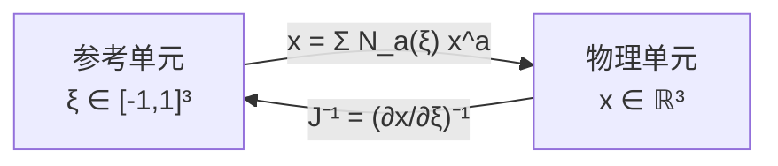
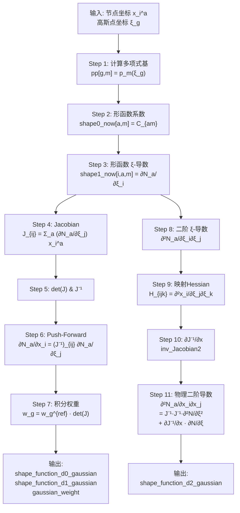

# 有限元等参变换与数值积分理论

本文档阐述三维固体力学有限元中等参变换（Isoparametric Mapping）与高斯数值积分（Gaussian Quadrature）的数学理论，对应代码实现位于 `src/torchfea/model/elements/dimension3/C3base.py` 的 `_pre_load_gaussian` 方法。

---

## 目录

- [1. 等参变换基本概念](#1-等参变换基本概念)
- [2. 参考空间与物理空间的映射](#2-参考空间与物理空间的映射)
- [3. 形函数及其导数](#3-形函数及其导数)
- [4. Jacobian 矩阵与坐标变换](#4-jacobian-矩阵与坐标变换)
- [5. 形函数物理梯度：Push-Forward](#5-形函数物理梯度push-forward)
- [6. 数值积分：高斯求积法](#6-数值积分高斯求积法)
- [7. 二阶导数（高级用途）](#7-二阶导数高级用途)
  - [7.1 形函数对参考坐标的二阶导数](#71-形函数对参考坐标的二阶导数)
  - [7.2 映射的二阶导数（Hessian of Mapping）](#72-映射的二阶导数hessian-of-mapping)
  - [7.3 Jacobian 逆矩阵的导数](#73-jacobian-逆矩阵的导数)
  - [7.4 形函数的物理空间二阶导数](#74-形函数的物理空间二阶导数)
- [8. 代码中的张量索引约定](#8-代码中的张量索引约定)
- [9. 完整计算流程图](#9-完整计算流程图)

---

## 1. 等参变换基本概念

有限元法中，每个单元定义在一个规则的**参考域（Reference Domain）**上（如正方体 $[-1,1]^3$ 或标准四面体），而非直接在复杂的物理域上。**等参变换**的核心思想是：用与位移场插值相同的形函数来描述几何映射。

设参考空间坐标为 $\boldsymbol{\xi} = (\xi_1, \xi_2, \xi_3)$，物理空间坐标为 $\mathbf{x} = (x_1, x_2, x_3)$。等参映射为：

$$
x_i(\boldsymbol{\xi}) = \sum_{a=1}^{n} N_a(\boldsymbol{\xi}) \, x_i^a
$$

其中 $N_a$ 为节点 $a$ 的形函数，$x_i^a$ 为节点 $a$ 在物理空间中的第 $i$ 个坐标分量，$n$ 为单元节点数。

> **"等参"（Isoparametric）的含义**：几何映射的形函数 $N_a$ 与位移场插值的形函数完全相同。

---

## 2. 参考空间与物理空间的映射

### 2.1 参考空间 $\boldsymbol{\xi}$

参考空间是归一化的参数空间，单元在此空间中具有规则的几何形状。例如：

| 单元类型             | 参考域             |
| -------------------- | ------------------ |
| 六面体 (C3D8, C3D20) | 正方体$[-1,1]^3$ |
| 四面体 (C3D4, C3D10) | 标准四面体         |
| 楔形 (C3D6, C3D15)   | 标准楔形           |

### 2.2 物理空间 $\mathbf{x}$

物理空间是单元在真实坐标系中的位置，通过等参映射从参考空间变换得到。

### 2.3 映射关系图



---

## 3. 形函数及其导数

### 3.1 形函数的多项式基表示

代码中，形函数以多项式基的系数矩阵形式存储。设多项式基向量为 $\mathbf{p}(\boldsymbol{\xi})$：

$$
\mathbf{p}(\boldsymbol{\xi}) = [1,\ \xi_1,\ \xi_2,\ \xi_3,\ \xi_1\xi_2,\ \xi_2\xi_3,\ \xi_3\xi_1,\ \xi_1^2,\ \xi_2^2,\ \xi_3^2,\ \ldots]^T
$$

形函数 $N_a(\boldsymbol{\xi})$ 表示为基函数的线性组合：

$$
N_a(\boldsymbol{\xi}) = \sum_{m} C_{am} \, p_m(\boldsymbol{\xi})
$$

其中 $C_{am}$ 为系数矩阵（代码中 `shape_function[0]`）。

### 3.2 形函数对参考坐标的一阶导数

$$
\frac{\partial N_a}{\partial \xi_i} = \sum_{m} C_{am} \, \frac{\partial p_m}{\partial \xi_i}
$$

代码中通过 `_shape_function_derivative` 逐项对多项式基求导实现。

**代码对应（Einstein 记号）**：

```
shape1_now[i, a, m] = ∂N_a/∂ξ_i  expressed in polynomial basis coefficients
```

### 3.3 形函数在积分点处的值

对于高斯积分点 $\boldsymbol{\xi}_g$，先计算多项式基在 $\boldsymbol{\xi}_g$ 处的值：

```
pp[g, m] = p_m(ξ_g)
```

则形函数值为：

$$
N_a(\boldsymbol{\xi}_g) = C_{am} \cdot p_m(\boldsymbol{\xi}_g)
$$

**代码**：`shapeFun0 = einsum('ab, gb->ga', shape0_now, pp)` 即 $N_{ga} = C_{am} \cdot p_{gm}$。

---

## 4. Jacobian 矩阵与坐标变换

### 4.1 Jacobian 矩阵定义

Jacobian 矩阵 $\mathbf{J}$ 描述参考空间到物理空间的局部映射关系，是一个 $3 \times 3$ 矩阵：

$$
J_{ij}(\boldsymbol{\xi}) = \frac{\partial x_i}{\partial \xi_j}
$$

### 4.2 由等参映射计算 Jacobian

将等参映射 $x_i = N_a x_i^a$ 对 $\xi_j$ 求导：

$$
J_{ij}(\boldsymbol{\xi}) = \frac{\partial}{\partial \xi_j} \left( \sum_a N_a(\boldsymbol{\xi}) \, x_i^a \right) = \sum_{a=1}^{n} \frac{\partial N_a(\boldsymbol{\xi})}{\partial \xi_j} \, x_i^a
$$

**代码（Einstein 记号）**：

```
temp_[g, m, a] = p_m(ξ_g) · C_{am}        # 中间量
J[g, e, i, j] += temp_[g, j, a] · x_i^a    # J_{ij} = Σ_a (∂N_a/∂ξ_j) · x_i^a
```

### 4.3 Jacobian 行列式的几何意义

$$
\det(\mathbf{J}) = \left| \frac{\partial(x_1, x_2, x_3)}{\partial(\xi_1, \xi_2, \xi_3)} \right|
$$

$\det(\mathbf{J})$ 表示参考空间微元与物理空间微元的体积比：

$$
\mathrm{d}\Omega = \det(\mathbf{J}) \, \mathrm{d}\xi_1 \mathrm{d}\xi_2 \mathrm{d}\xi_3
$$

### 4.4 Jacobian 逆矩阵

逆矩阵 $\mathbf{J}^{-1}$ 将参考空间的梯度变换为物理空间的梯度：

$$
\frac{\partial}{\partial x_i} = (J^{-1})_{ij} \, \frac{\partial}{\partial \xi_j}
$$

---

## 5. 形函数物理梯度：Push-Forward

物理空间中形函数的梯度是有限元计算的核心量（用于计算应变-位移矩阵 $\mathbf{B}$）。

### 5.1 链式法则

$$
\frac{\partial N_a}{\partial x_i} = \frac{\partial N_a}{\partial \xi_j} \cdot \frac{\partial \xi_j}{\partial x_i} = \frac{\partial N_a}{\partial \xi_j} \cdot (J^{-1})_{ji}
$$

### 5.2 矩阵形式

记形函数参考梯度矩阵 $[\nabla_{\boldsymbol{\xi}} N]$ （$n \times 3$），则物理梯度为：

$$
[\nabla_{\mathbf{x}} N] = [\nabla_{\boldsymbol{\xi}} N] \cdot \mathbf{J}^{-T}
$$

或按分量：

$$
\frac{\partial N_a}{\partial x_i} = (J^{-1})_{ij} \, \frac{\partial N_a}{\partial \xi_j}
$$

### 5.3 代码实现

```
shapeFun1[g, e, i, a] = (J⁻¹)_{ij}|_{ξ_g} · ∂N_a/∂ξ_j|_{ξ_g}
```

即 `einsum('gemi,gb,mab->geia', inv_Jacobian, pp, shape1_now)`。

---

## 6. 数值积分：高斯求积法

### 6.1 积分变换

有限元中的体积积分通过等参变换从物理空间转到参考空间：

$$
\int_{\Omega_e} f(\mathbf{x}) \, \mathrm{d}\Omega = \int_{\square} f(\boldsymbol{\xi}) \, \det(\mathbf{J}) \, \mathrm{d}\boldsymbol{\xi}
$$

### 6.2 高斯求积公式

参考域上的积分用高斯求积（Gaussian Quadrature）近似：

$$
\int_{\square} g(\boldsymbol{\xi}) \, \mathrm{d}\boldsymbol{\xi} \approx \sum_{g=1}^{n_g} w_g^{\text{ref}} \, g(\boldsymbol{\xi}_g)
$$

其中 $n_g$ 为高斯积分点个数，$\boldsymbol{\xi}_g$ 为积分点坐标，$w_g^{\text{ref}}$ 为参考权重。

### 6.3 物理空间中的积分权重

结合等参变换，物理空间中的积分权重为：

$$
\boxed{w_g = w_g^{\text{ref}} \cdot \det(\mathbf{J})|_{\boldsymbol{\xi}_g}}
$$

完整的数值积分格式：

$$
\int_{\Omega_e} f(\mathbf{x}) \, \mathrm{d}\Omega \approx \sum_{g=1}^{n_g} w_g \, f(\mathbf{x}(\boldsymbol{\xi}_g))
$$

### 6.4 代码

```
self.gaussian_weight[g, e] = det(J)|_{g,e} · w_g^{ref}
```

即 `einsum('ge, g->ge', det_Jacobian, self.gaussian_weight_ref)`。

### 6.5 减缩积分与完全积分

| 积分方案                                 | 说明                                         |
| ---------------------------------------- | -------------------------------------------- |
| **完全积分 (Full Integration)**    | 使用足够多的高斯点精确积分多项式刚度矩阵     |
| **减缩积分 (Reduced Integration)** | 使用较少的高斯点，避免剪切闭锁，但需沙漏控制 |

---

## 7. 二阶导数（高级用途）

### 7.1 形函数对参考坐标的二阶导数

$$
\frac{\partial^2 N_a}{\partial \xi_i \partial \xi_j}
$$

用于灵敏度分析、曲率相关计算等高级场景。

### 7.2 映射的二阶导数（Hessian of Mapping）

$$
H_{ijk} = \frac{\partial^2 x_i}{\partial \xi_j \partial \xi_k} = \sum_{a=1}^{n} \frac{\partial^2 N_a}{\partial \xi_j \partial \xi_k} \, x_i^a
$$

**代码**：`Jacobian2[g, e, i, m, n]`。

### 7.3 Jacobian 逆矩阵的导数

对恒等式 $\mathbf{J} \cdot \mathbf{J}^{-1} = \mathbf{I}$ 两边对物理坐标 $x_k$ 求导：

$$
\frac{\partial}{\partial x_k} \left( \mathbf{J} \cdot \mathbf{J}^{-1} \right) = \mathbf{0}
$$

应用链式法则：

$$
\frac{\partial \mathbf{J}}{\partial x_k} \cdot \mathbf{J}^{-1} + \mathbf{J} \cdot \frac{\partial \mathbf{J}^{-1}}{\partial x_k} = \mathbf{0}
$$

整理得：

$$
\frac{\partial \mathbf{J}^{-1}}{\partial x_k} = -\mathbf{J}^{-1} \cdot \frac{\partial \mathbf{J}}{\partial x_k} \cdot \mathbf{J}^{-1}
$$

其中 $\partial \mathbf{J}_{ij}/\partial x_k$ 需要用链式法则从 $\xi$ 空间变换过来：

$$
\frac{\partial J_{ij}}{\partial x_k} = \frac{\partial}{\partial x_k} \left( \frac{\partial x_i}{\partial \xi_j} \right)
  = \frac{\partial^2 x_i}{\partial \xi_j \partial \xi_p} \cdot \frac{\partial \xi_p}{\partial x_k}
  = H_{ijp} \cdot (J^{-1})_{pk}
$$

代入并展开为张量分量形式：

$$
\boxed{\frac{\partial (J^{-1})_{ml}}{\partial x_k} = -(J^{-1})_{mj} \cdot (J^{-1})_{pk} \cdot (J^{-1})_{nl} \cdot H_{jnp}}
$$

这里的 $H_{jnp} = \partial^2 x_j/\partial \xi_n \partial \xi_p$ 是映射的Hessian。

**代码（张量形式，直接简化版本）**：

```
inv_Jacobian2[g, e, m, l, k] = -J⁻¹_{mj} · J⁻¹_{pk} · J⁻¹_{nl} · H_{jnp}
```

即：

```python
inv_Jacobian2 = -torch.einsum(
    'gemj,gepk,genl,gejnp->gemlk', inv_Jacobian,
    inv_Jacobian, inv_Jacobian, Jacobian2)
```

其中 `[g, e]` 为高斯点与单元索引，`J⁻¹` 形状为 `[g, e, i, j]`，`H` (Jacobian2) 形状为 `[g, e, j, n, p]`。

### 7.4 形函数的物理空间二阶导数

物理空间中形函数的二阶导数 $\partial^2 N_a/\partial x_i \partial x_j$ 对计算几何刚度矩阵和灵敏度分析至关重要。

从一阶导数 $\partial N_a/\partial x_i = (J^{-1})_{im} \, \partial N_a/\partial \xi_m$ 出发，再对 $x_j$ 求导，应用链式法则：

$$
\frac{\partial^2 N_a}{\partial x_i \partial x_j}
= \frac{\partial}{\partial x_j} \left[ (J^{-1})_{im} \cdot \frac{\partial N_a}{\partial \xi_m} \right]
$$

展开为两项：

$$
\boxed{
\frac{\partial^2 N_a}{\partial x_i \partial x_j}
= (J^{-1})_{im} \cdot (J^{-1})_{jn} \cdot \frac{\partial^2 N_a}{\partial \xi_m \partial \xi_n}
+ \frac{\partial (J^{-1})_{im}}{\partial x_j} \cdot \frac{\partial N_a}{\partial \xi_m}
}
$$

#### Term 1：等参Hessian的Push-Forward

第一项是二阶 $\xi$-导数经两次 $J^{-1}$ 变换到物理空间：

$$
\text{Term1} = (J^{-1})_{im} \cdot (J^{-1})_{jn} \cdot \frac{\partial^2 N_a}{\partial \xi_m \partial \xi_n}
$$

**代码**：

```python
term1 = torch.einsum('gemi, genj, gmna->geija',
                     inv_Jacobian, inv_Jacobian, shape2_gaussian)
```

其中 `shape2_gaussian[g, i, j, a] = ∂²N_a/∂ξ_i∂ξ_j|_{ξ_g}`。

#### Term 2：$J^{-1}$ 导数修正项

第二项来源于 $J^{-1}$ 随空间位置变化产生的修正：

$$
\text{Term2} = \frac{\partial (J^{-1})_{im}}{\partial x_j} \cdot \frac{\partial N_a}{\partial \xi_m}
$$

**代码**：

```python
term2 = torch.einsum('gemij, gma->geija',
                     inv_Jacobian2, shape1_gaussian)
```

其中 `inv_Jacobian2[g, e, i, m, j] = ∂(J^{-1})_{im}/∂x_j`，
`shape1_gaussian[g, m, a] = ∂N_a/∂ξ_m|_{ξ_g}`。

#### 合并结果

```python
self.shape_function_d2_gaussian = term1 + term2
# shape: [g, e, i, j, a]  →  ∂²N_a/∂x_i∂x_j at each Gauss point
```

---

## 8. 代码中的张量索引约定

在 `_pre_load_gaussian` 方法及整个模块中，使用以下索引字母约定：

| 索引        | 含义                               | 范围                       |
| ----------- | ---------------------------------- | -------------------------- |
| `g`       | 高斯积分点 (Gauss point)           | $1 \sim n_g$             |
| `e`       | 单元 (Element)                     | $1 \sim n_e$             |
| `a, b`    | 单元节点 (Node)                    | $1 \sim n_{\text{node}}$ |
| `i, j, k` | 物理空间坐标分量$x_i$            | $1 \sim 3$               |
| `m, n, p` | 多项式基索引 / 参考坐标分量$\xi$ | 视阶数而定 /$1 \sim 3$   |

### 张量形状速查

| 张量                           | 形状                | 含义                                                           |
| ------------------------------ | ------------------- | -------------------------------------------------------------- |
| `pp`                         | `[g, m]`          | 多项式基在$\boldsymbol{\xi}_g$ 处的值                        |
| `shape0_now`                 | `[a, m]`          | 形函数的多项式基系数$C_{am}$                                 |
| `shape1_now`                 | `[i, a, m]`       | $\partial N_a/\partial \xi_i$ 的多项式系数                   |
| `Jacobian`                   | `[g, e, i, j]`    | $J_{ij} = \partial x_i/\partial \xi_j$                       |
| `inv_Jacobian`               | `[g, e, i, j]`    | $(J^{-1})_{ij}$                                              |
| `shapeFun1`                  | `[g, e, i, a]`    | $\partial N_a/\partial x_i$ 在高斯点处的值                   |
| `shapeFun0`                  | `[g, e, a]`       | $N_a$ 在高斯点处的值                                         |
| `gaussian_weight`            | `[g, e]`          | 物理空间积分权重$w_g$                                        |
| `Jacobian2`                  | `[g, e, i, m, n]` | $\partial^2 x_i/\partial \xi_m\partial \xi_n$                |
| `shape2_gaussian`            | `[g, i, j, a]`    | $\partial^2 N_a/\partial \xi_i\partial \xi_j$ 在高斯点处的值 |
| `inv_Jacobian2`              | `[g, e, i, j, k]` | $\partial (J^{-1})_{ij}/\partial x_k$                        |
| `shape_function_d2_gaussian` | `[g, e, i, j, a]` | $\partial^2 N_a/\partial x_i\partial x_j$ 在高斯点处的值     |

---

## 9. 完整计算流程图



---

## 参考文献

1. Hughes, T.J.R. *The Finite Element Method: Linear Static and Dynamic Finite Element Analysis*. Dover, 2000.
2. Zienkiewicz, O.C. & Taylor, R.L. *The Finite Element Method*, 7th ed. Butterworth-Heinemann, 2013.
3. Bathe, K.J. *Finite Element Procedures*, 2nd ed. Prentice Hall, 2014.
4. Belytschko, T., Liu, W.K., Moran, B. & Elkhodary, K. *Nonlinear Finite Elements for Continua and Structures*, 2nd ed. Wiley, 2014.
